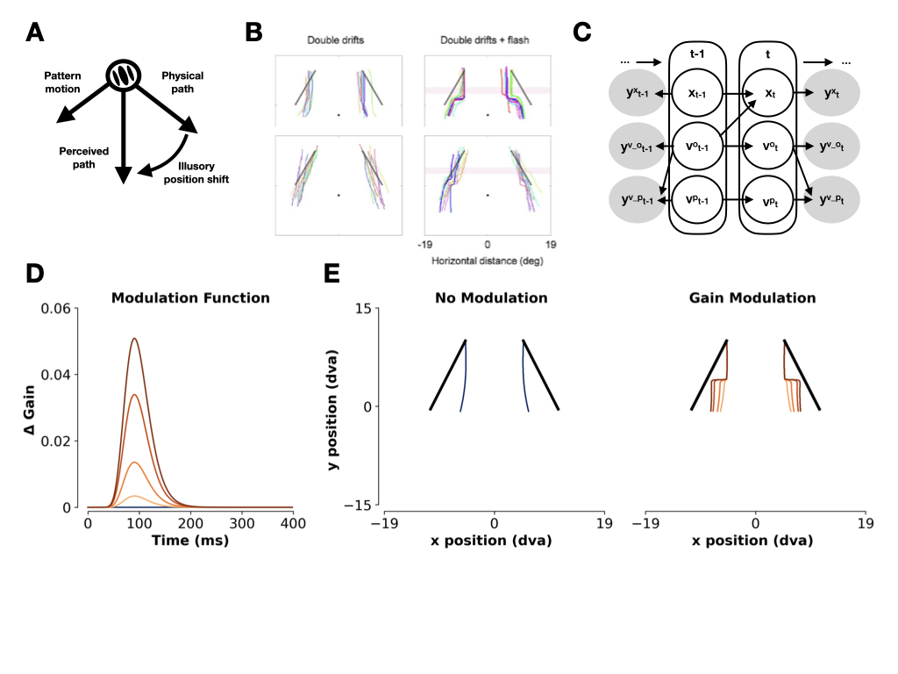

# position-reset-model

This repository contains code (Python & MATLAB) for simulating 'position resets' within a recursive Bayesian estimation framework.

Preprint: https://osf.io/preprints/psyarxiv/98rb6

The original object-tracking model comes from [Kwon, Tadin, & Knill (2015) – *PNAS*](https://www.pnas.org/doi/full/10.1073/pnas.1500361112). 

Here, we explore the effect of transient gain modulations, showing that these are sufficient to trigger position resets
as described by [Nakayama & Holcombe (2020)](https://jov.arvojournals.org/article.aspx?articleid=2765454), see also ['t Hart, Henriques, & Cavanagh (2022)](https://jov.arvojournals.org/article.aspx?articleid=2778600) and [Liu, Tse, & Cavanagh (2021)](https://www.biorxiv.org/content/10.1101/2021.12.14.472615v1). 

Auxiliary simulations of potential underlying drivers of gain changes are included in [this notebook](https://github.com/bootstrapbill/position-reset-model/blob/main/auxiliary_simulations.ipynb). Additional simulations looking at the effect of changes in sensory uncertainty are included in [this notebook](https://github.com/bootstrapbill/position-reset-model/blob/main/simulate_uncertainty_changes.ipynb).

